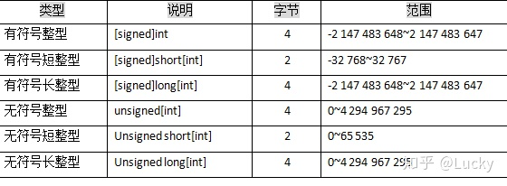
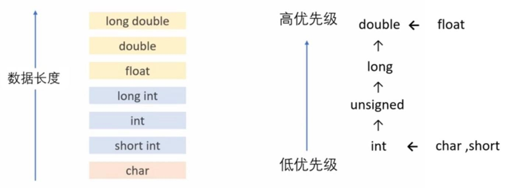

# C++基本数据类型与表达式
这一章是非常基础的内容，需要理解和记忆。
## 基本数据类型
C++的基本数据类型，可以分为整型（int）、实型（float）、双精度型（double）、字符型（char）、布尔型（bool）和无值型（void）等。在这里的介绍顺序与书中不同，将按照常量和变量两大类来划分，以求更清晰的总结与分辨。
## 常量
顾名思义，常量就是值不能改变的量，分为两种类型：直接常量和符号常量。
直接常量：直接写出来的常量，比如30、30.0等。
符号常量：又称命名常量，指有名字的常量。它的定义有两种方式：
```cpp
const double PI = 3.1415;//用常量说明符const定义符号常量
#define PI 3.1415//使用编译预处理指令定义符号常量
```
### 1. 整型常量
有符号整型有short int、int、long int、long long int，这4个也默认为signed XX。
规则：short至少16位；int至少和short一样；long至少32位，且至少和int一样长；long long至少64位，且至少和long一样长。
这4个有符号整型都有无符号变体。分别是unsigned short、unsigned int、unsigned long和unsigned long long。
注意，unsigned本身是unsigned int的缩写。
注意，这些分类在整型变量中也通用。

在C++中，我们把带有“0”前缀的常量认作是八进制的常量，“0x”或者“0X”前缀的认作16进制，没有前两种情况的默认是十进制。默认情况下，这些字符常量可以是int，也可以是long，主要取决于定义的类型是否适合字符的长度。
```cpp
123//十进制
0123//八进制
0x123//十六进制
```
同样，通过给整型常量加上后缀，我们也可以特别定义这个常量的类型，如unsigned或者是long。后缀与被定义的字符之间不能有空格。
```cpp
128u//加u或者U是无符号整型常数（unsigned）
1L//加l或者L是长整型常数（long）
```
通常情况下，我们使用大写的“L”来定义long，主要是为了防止“l”和“1”混淆。
### 2. 浮点型常量
浮点的基本数据类型有3个，float、double和long double。
float占4字节，double占8字节，long double占16字节。

我们可以使用十进制或者科学技术的方式来书写浮点型字符常量。如果是使用科学计数法，那么指数（幂）是在“E”或者“e”后面特别标明的。
默认情况下，浮点型字符常量是double型，如果要表示单精度的浮点型常量，我们要在数值后面标明“F”或者“f”。同样的，我们特别通过添加后缀“L”或者“l”(“l”不鼓励使用)来声明extended precision(扩展精度)类型。如下举例，每一列的值其实是一样的：
```cpp
     3.14159F      .001f       12.345l         0.

     3.14159E0f    1E-3F       12345E1L        0e0
```

### 3. 字符型常量
字符型常量是单引号括起来的普通字符或者转义字符。
(1) 普通的字符常量
用单撇号括起来的一个字符就是字符型常量。如'a', '#', '%', 'D'都是合法的字符常量，在内存中占一个字节。注意：
- 字符常量只能包括一个字符，如'AB' 是不合法的。
- 字符常量区分大小写字母，如'A'和'a'是两个不同的字符常量。
- 撇号(')是定界符，而不属于字符常量的一部分。如cout<<'a';输出的是一个字母"a"，而不是3个字符"'a' "。
(2) 转义字符常量
除了以上形式的字符常量外，C++还允许用一种特殊形式的字符常量，就是以 "\"开头的字符序列。例如，'\n'代表一个"换行"符。"cout<<'\n'; " 将输出一个换行，其作用与cout<<endl; 相同。
```cpp
//常用的转义字符
'\n'    //换行
'\t'    //水平制表（Tab）
'\\'    //相当于一个反斜杠
'\ddd'  //1~3位八进制数代表的字符，如'\32'、'\032'（加不加0都行）
'\xhh'  //1~2位十六进制数代表的字符，必须以x开头，如'\x24'
'\0'    //置空字符，ASCII码为0
```
字符常量的值，就是它在ASCII编码表中的值。是个从0—127之间的整数。因此字符常量可以作为整型数据来进行运算。例如：表达式‘Y’+32的值为121，也就是‘Y’的值。
### 4. 字符串常量
用双撇号括起来的部分就是字符串常量，如"abc"，"Hello!"，"a+b"，"Li ping"都是字符串常量。
编译系统会在字符串最后自动加一个'\0'作为字符串结束标志。虽然占了一字节的内存，但'\0'并不是字符串的一部分，它只作为字符串的结束标志。字符串常量"abc"在内存中占4个字节（而不是3个字节）。但“ cout<<"abc"<<endl; ”输出3个字符abc，而不包括'\0'。
## 变量
同样顾名思义，值可以改变的量叫变量。每一个变量都在内存里拥有一块数据单元，但数据单元的大小有所不同。这就像买房一样，有人需要大房子，有人需要小房子。于是变量的数据类型就成了它“买房”的凭证，按类型分地，非常公平。
分配存储单元的时候，是要分清形形色色的变量的，所以要给它们起不一样的名字。这个“名字”就是标识符。（当然，除了“黑户”匿名空间）
起名字也是有规矩的，这是C++的地盘，能起什么名字、不能用什么名字都由它定。让我们来看看它的规矩：
首先，标识符必须由字母（大小写敏感）、数字、下划线“_”组成，且数字不能放在第一位。
不能起的名字都列在了一张表里，这些名字就叫关键字，包括基本数据类型的名字int、double等。
了解过起名字的“能与不能”，就可以来创造一些变量了。
```cpp
//格式：类型说明符 变量名1,变量名2...变量名n;
int i,j,k;
i = 5;//给变量赋值
double r = 2;//定义变量时直接赋初值
```

### 1. 整型变量
到了变量这里，不同类型开始拥有了不同的空间，整型的兄弟姐妹也不例外。

记住int是4个字节，这是最常用的了。

### 2. 字符型变量
可以使用整型值给单个字符型变量赋值，举例如下：
```cpp
grade = 'A';
grade = '\101';
grade = '\x41';
grade = 65;
grade = 0101;
grade = 0x41;//以上grade的值均相等
```
## 类型转换
1. 优先级

2. 赋值时转换规则
实转整：去小数留整数
少字节转多字节：符号扩展
多字节转少字节：高位舍去
1. 强制转换
```cpp
int x = 2;
int a = (int)(3.5+x);//格式：（类型名）（表达式）
double b = (double)a;
```
## 运算符与表达式
1. 操作符的优先级
运算符优先级简要总结如下：
自增（++）、自减（--）、逻辑非（!）>算术（*、/、%、+、-）>移位>关系（>=、<=、<、>、==、!=）>逻辑（&&、||）>赋值（=）>逗号（,）。
2. 两个整数以“/”相除，结果是整数。
3. 逻辑与 && 和逻辑或 || 是短路求值：当运算结果已经确定时，后面的表达式就不会再执行。
4. 复合赋值运算符（+=、-=、*=、/=、%=）
```cpp
a += b+5;//相当于a=a+(b+5)
a *= 2;//相当于a=a*2
```
5. 自增/自减运算符（只能用于变量）
   前置（++i）：先自加，表达式的返回值是i+1
   后置（i++）：表达式的返回值是i，再自加
6. 逗号运算符
```cpp
int a = 2,b,c,d;
cout<<(b = a*2,c = a*a+b,d = b+c);//这个表达式的返回值是12
```
7. sizeof()运算符返回一条表达式或者一个类型名字所占的字节数。
8. 表达式在内存中是没有具体的内存空间的。

