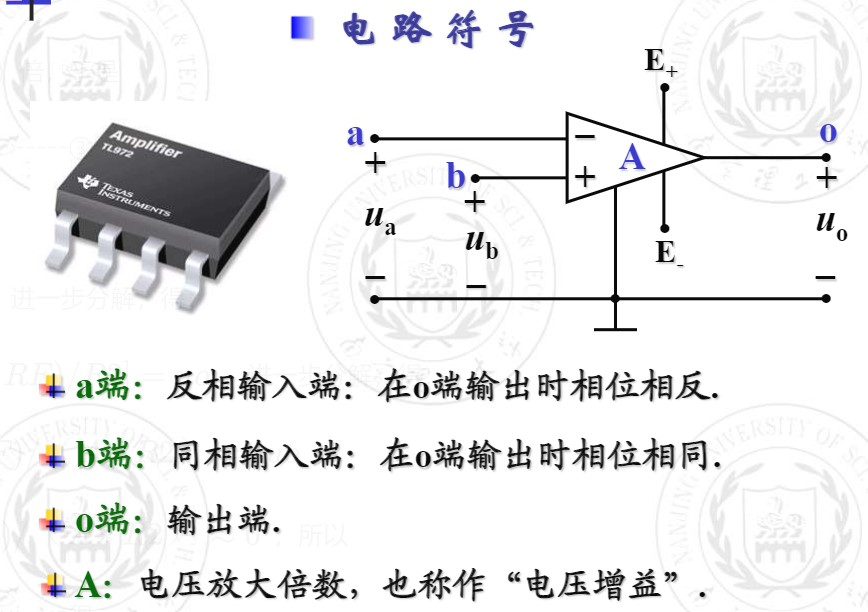
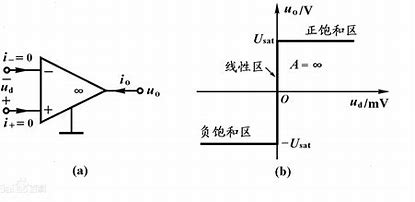
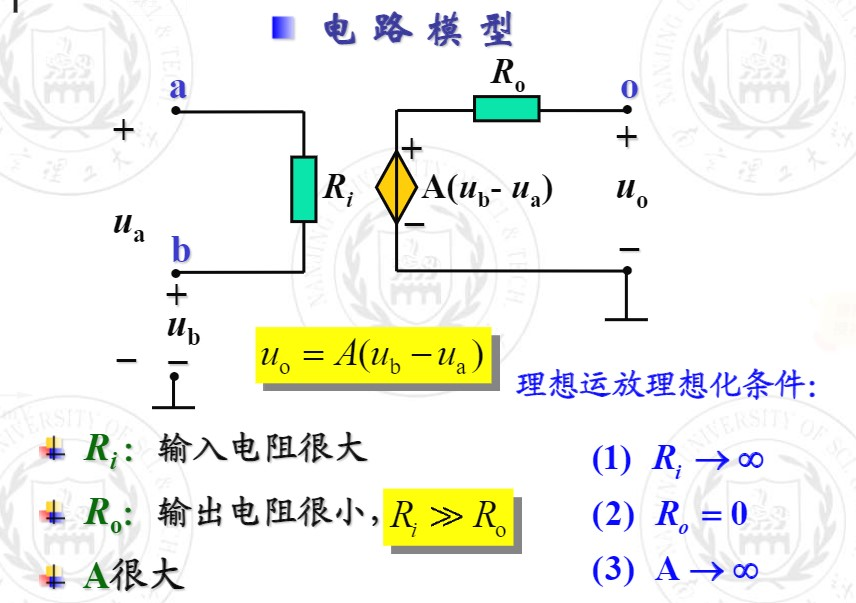

# 运算放大器
插播一则广告：放大电压信号哪家强？模电电路找运放！模拟信号运算哪家早？还是得靠咱运放！运放，小三角，大能量！
## 运放概述
运算放大器，洋名儿叫**Operation Amplifier**，简写为**OP AMP**。是个长得跟芯片差不多的**集成电路元件**，只不过引脚少一些。
顾名思义，运算放大器的初衷是用于**执行数学计算**，比如加、减、乘、除、函数运算等。在当前的技术条件下，运算放大器的数学运算功能已不再突出，现在主要应用**于信号放大及有源滤波器设计**。
现在各种测量电路、音响电路、有源滤波器、电压比较器、恒流源、加（减）法器、桥式传感器放大电路等，缺了运放就没法儿工作，可以说是**模电祖师爷**。

## 运放模型
运放在正常工作时，需将一个直流正电源和一个直流负电源与运放的电源端$E_+$和$E_-$相连。两个电源的公共端构成运放的**外部接地端**。但是咱一般不用考虑他俩，焊上去的时候可别忘了它就成。

运放与外部电路连接的端钮只有四个：**两个输入端、一个输出端和一个接地端**。
这样，运放可看为是一个`四端元件`。

$u_-$、$u_+$和$u_o$分别表示`反相输入端`、`同相输入端`和`输出端相对接地端`的**电压**。$u_d=u_+-u_-$称为**差模输入电压**。
输出端口处的$u_o$与差模输出电压之间的函数关系叫做运放的`转移特性`。如图。

**那怎么知道运放在哪个区域工作呢？**
理想集成运算放大电路工作在`线性区`时**必须通过外部元件引入`负反馈`**。
此时，$U_－＝U_＋$，$I_－＝I_＋＝0$。
具体可看这篇[为什么运算放大器加入了负反馈，就会有虚短、虚断的特性？闭环放大倍数就会取决于外部电路？](https://zhuanlan.zhihu.com/p/345932012)

**工作在非线性区时应开环或正反馈运用**。
此时$I_－＝I_＋＝0$；在$U_－＞U_＋$时，$U_o＝U_{OL}$；在$U_－＜U_＋$时，$U_o＝U_{OH}$。

当运放工作在`线性区域`时，**才可以简化为如图所示的电路模型**。

一个**理想的运算放大器**（ideal OPAMP）必须具备下列特性：
**无限大的输入阻抗**（$Zin=∞$）：理想的运算放大器输入端不容许任何电流流入，即上图中的V+与V-两端点的电流信号恒为零，亦即输入阻抗无限大。
**趋近于零的输出阻抗**（$Zout=0$）：理想运算放大器的输出端是一个完美的电压源，无论流至放大器负载的电流如何变化，放大器的输出电压恒为一定值，亦即输出阻抗为零。
**无限大的开回路增益**（$Ad=∞$）：理想运算放大器的一个重要性质就是开回路的状态下，输入端的差动信号有无限大的电压增益，这个特性使得运算放大器十分适合在实际应用时加上负反馈组态。

正因为输入电阻无穷大，**输入电路近似于断路**，也几乎没有电流，这称为`虚断`。此时电流可以为0，但不能真正把这条支路断开。
正因为输出电阻无穷小，电压增幅A接近于无穷大，**差模输出电压接近于0**，此之为`虚短`。此时看似a、b电压相等，却不能真正地将两端短接。
还有一种由`虚短`衍生出的`虚地`。
当a、b两端中有一端接地时，**另一端的电位自然归零**，但不能真正地将它接地。

关于常用的运放电路可以戳：[11个经典运算放大器电路（收藏备用）](https://zhuanlan.zhihu.com/p/411307149)

诶诶，前边说了几种电路分析方法，这运放电路也是电路，哪种方法能解决呢？
运放是基于电压放大的，再加上通常都有的接地线路，往电压上考虑当然是最好。
我们采用`节点电压法`分析含有理想运放的电路。
但是理想运放输出端的电流往往难以确定，节点电压法的本质便是KCL，所以我们一不做二不休，直接**别给输出端节点列方程**。
多嘴一句，咱列节点电压方程也是依着`虚断`原理的，解题时可别忘写啦。

最后，运放虽小，功能强大，学模电之前可别忘了它呢。